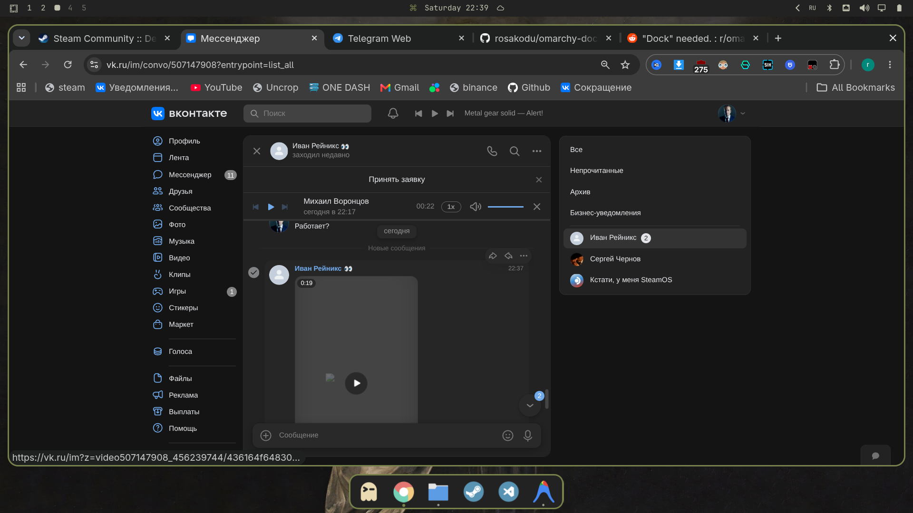

# 🚀 Omarchy Dock (`lotos.dock`)

> **Нативный анимированный плагин дока приложений для Omarchy Quattro Shell на базе Quickshell (QML) и Hyprland.**



---

## ✨ Возможности

1. **🎨 Полная интеграция с темами Omarchy**:
   - Автоматически синхронизируется с текущей темой Omarchy через `Color` (`qs.Commons`).
   - При смене темы обоев/стилей цвета дока обновляются на лету без перезапуска (`Color.accent`, `Color.bar.background`, `Color.bar.text`, `Color.urgent`).
   - Радиус скругления и толщина обводки читаются напрямую из настроек оформления Hyprland (`decoration:rounding`, `general:border_size`).

2. **⚡ Нативный движок без фоновых демонов**:
   - Работает внутри единого процесса `omarchy-shell` через Wayland Layer-Shell (`Quickshell`).
   - Нулевая задержка, высокая производительность и монолитная стабильность без дрожания окон.

3. **🔘 Виджет в баре Omarchy**:
   - Отображает иконку в статусбаре с динамической подсветкой (акцентный цвет при включенном доке, приглушенный при скрытом).
   - **ЛКМ**: Мгновенно скрывает / показывает док.
   - **ПКМ**: Открывает каталог выбора иконки для виджета (`IconPickerMenu.qml`).

4. **🖐️ Интуитивный Drag & Drop**:
   - Зажмите ЛКМ на любой иконке и потяните вдоль дока, чтобы изменить порядок приложений.
   - Плавная анимация смещения соседних иконок.
   - Порядок автоматически сохраняется в `~/.config/omarchy/dock-pinned.json`.

5. **🧭 Адаптивное позиционирование напротив статусбара**:
   - Бар **вверху (Top)** $\rightarrow$ Док **снизу (Bottom)** (горизонтальный).
   - Бар **слева (Left)** $\rightarrow$ Док **справа (Right)** (вертикальный).
   - Бар **снизу (Bottom)** $\rightarrow$ Док **вверху (Top)** (горизонтальный).
   - Бар **справа (Right)** $\rightarrow$ Док **слева (Left)** (вертикальный).

6. **🎯 Всплывающее меню действий (Action Card)**:
   - **ПКМ** по иконке приложения открывает всплывающее меню строго над выбранным приложением:
     - **`★` / `☆` (Закрепить / Открепить)**: управление закреплением в доке.
     - **`＋` (Новое окно)**: запуск новой копии приложения через `uwsm-app -- gtk-launch`.
     - **`✕` (Закрыть)**: закрытие всех окон приложения через диспетчер `hl.dsp.window.close`.

7. **🚀 Умный перенос на Workspace и фокус**:
   - Клик по иконке приложения мгновенно переносит пользователя на тот рабочий стол, где это окно открыто, и активирует его.

8. **🖼️ Интеграция с системными иконками**:
   - Использует `AppLibrary` и XDG Icon Theme specification — иконки 100% совпадают с системным меню приложений.

---

## 🛠️ Установка

### Вариант 1: Через Git (рекомендуется)

```bash
mkdir -p ~/.config/omarchy/plugins
git clone https://github.com/rosakodu/omarchy-dock.git ~/.config/omarchy/plugins/lotos.dock
```

### Вариант 2: Локально

```bash
mkdir -p ~/.config/omarchy/plugins
cp -r /path/to/Dock ~/.config/omarchy/plugins/lotos.dock
```

---

## 🔄 Активация

1. Перезагрузите shell Omarchy:
   ```bash
   omarchy-restart-shell
   ```
2. Откройте настройки бара Omarchy (`Super + ,` или правый клик по бару -> Настройки бара) и добавьте виджет **Dock** в любую секцию (например, `center`).

---

## 📂 Структура проекта

```
omarchy-dock/
├── manifest.json        # Манифест плагина для Omarchy Shell
├── BarWidget.qml        # Виджет статусбара (кнопка вкл/выкл + выбор иконки)
├── DockPanel.qml        # Основное окно дока и всплывающее меню действий (Wayland Layer Shell)
├── DockItem.qml         # Компонент иконки приложения (DnD, зум, запуск, индикатор активности)
├── DockModel.js         # Модель данных, закрепление, открепление, сортировка окон
├── IconResolver.js      # Поиск и сопоставление XDG .desktop и иконок темы
├── IconPickerMenu.qml   # Меню выбора иконки виджета для статусбара
├── screenshot.png       # Скриншот для README
└── README.md            # Документация
```

---

## 📄 Лицензия

MIT License © 2026 rosakodu & Lotos
