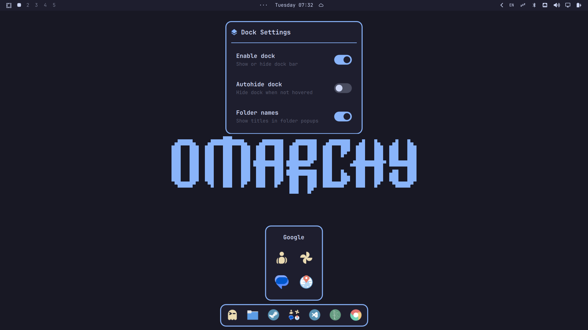

# Omarchy Dock



A modern, highly polished, and fully native application dock plugin for **Omarchy Quattro** (Hyprland + Quickshell), featuring app stacks (folders), iOS-style edit wiggle animations, multi-window management, dynamic orientation, and seamless theme integration.

---

## ✨ Features

- 📁 **App Stacks (Folders)** — Organize apps into folders with multi-column grids. Create folders by simply dragging one icon onto another. Customize folder icons with built-in Nerd Font glyphs, edit titles inline, and enjoy marquee text scrolling for long names.
- ✨ **iOS-Style Edit Mode (Wiggle)** — Long-press (450ms) any icon to enter edit mode with smooth physical wobbling ($\pm 3.8^\circ$, 105ms). Quickly toggle favorite pins (`★`), dissolve folders (`-`), or reorder apps.
- 🔀 **Fluid 1D & 2D Drag & Drop** — Smooth rail displacement physics when dragging apps across the dock or within folder grids. Effortlessly extract apps from folders back to the main dock.
- 🪟 **Open Windows Manager** — Right-click any running app with multiple instances to open a clean window selector card, stably ordered by creation time.
- 🌐 **Full Web Apps (PWA) Support** — Automatic domain matching for Chrome/Chromium web apps (Google Maps, Google Contacts, WhatsApp, YouTube, Discord, etc.) with native GTK theme icons.
- ⚡ **Zero-Flicker Boot & Tile Lift** — Two-phase initialization instantly reserves Hyprland exclusive space to lift tiled windows smoothly, followed by a monolithic fade-in once all vector theme icons are loaded.
- 🧭 **Dynamic Auto-Positioning** — Automatically adapts its position opposite to the Omarchy status bar (top $\leftrightarrow$ bottom, left $\leftrightarrow$ right).
- ⏱️ **Smart Auto-Hide** — Optional auto-hide with a 1.5-second dismissal delay and instant hover reveal.
- 🎛️ **Status Bar Settings Widget (`BarWidget`)** — Native top bar menu with smooth toggle switches for Dock Enable, Auto-hide, and Folder Titles.
- 🎨 **100% Native Theme Sync** — Automatically reacts to Omarchy colors (`Color.accent`, `Color.bar.background`), system fonts, borders, and window corner radius tokens.
- 🔤 **Subpixel Vector Glyphs (`DockGlyph`)** — GPU-accelerated vector curve rendering without font hinting distortion or pixel jitter during animations.

---

## 📦 Installation

Install and enable the dock with a single command:

```bash
omarchy plugin add https://github.com/rosakodu/omarchy-dock.git --enable
```

---

## ⚙️ Configuration

The dock works out of the box with zero configuration required.

You can customize options directly via the `···` status bar widget or in `~/.config/omarchy/dock-settings.json`:

```json
{
  "dockEnabled": true,
  "autohide": false,
  "showFolderTitles": true
}
```

Pinned items and folder layouts are automatically saved to `~/.config/omarchy/dock-pinned.json`.

---

## 🗑️ Uninstallation

```bash
omarchy plugin remove rosakodu.dock
```

---

## 📄 License

[MIT](./LICENSE) © 2026 rosakodu
