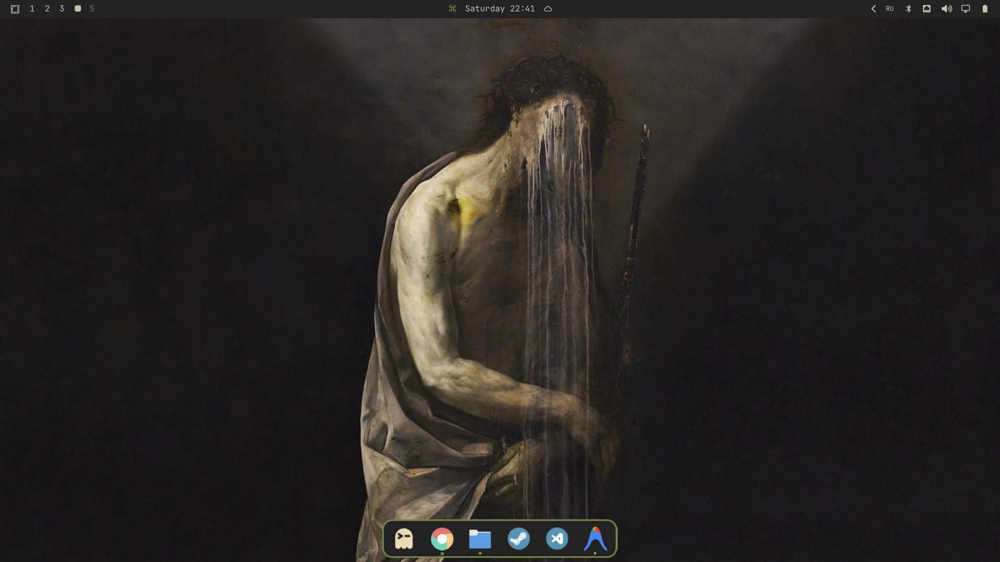

# Omarchy Dock



A native, animated application dock for Omarchy Quattro with Hyprland workspace tracking, Drag & Drop reordering, and seamless Omarchy theme integration.

---

## 📦 Manual Installation

### 1. Clone the repository
Clone this plugin directly into your Omarchy plugins directory:

```bash
git clone https://github.com/rosakodu/omarchy-dock.git ~/.config/omarchy/plugins/rosakodu.dock
```

### 2. Rescan plugins & restart shell
Reload Omarchy shell to discover and register the new plugin:

```bash
omarchy-shell shell rescanPlugins
omarchy-restart-shell
```

### 3. Recommended Hyprland Layer Rule
To ensure instant, smooth geometry updates without compositor-level layer animation stretching, add this rule to your `~/.config/hypr/looknfeel.lua` (or `~/.config/hypr/hyprland.conf`):

```lua
hl.layer_rule({ match = { namespace = "^(omarchy-dock|omarchy-dock-menu)$" }, no_anim = true, animation = "none" })
```

Then reload Hyprland:
```bash
hyprctl reload
```

---

## 🗑️ Uninstallation

To remove the dock:

```bash
rm -rf ~/.config/omarchy/plugins/rosakodu.dock
omarchy-shell shell rescanPlugins
omarchy-restart-shell
```

---

## 📄 License
[MIT](./LICENSE) © 2026 rosakodu
