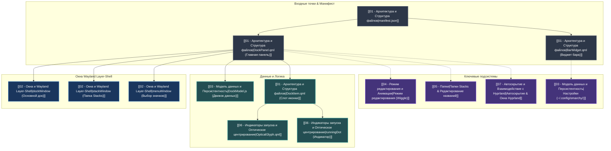

# 🪐 Omarchy Dock — Главная карта проекта (MOC)

> **Omarchy Dock** — нативный анимированный док-бар приложений для среды **Omarchy Quattro (Wayland / Hyprland / Quickshell)** с поддержкой динамического позиционирования, группировки в папки (macOS Stacks), отслеживания запущенных окон, Drag & Drop и глубокой интеграции с темами Omarchy.

---

## 🗺️ Граф компонентов и связей

---

## 📚 Разделы базы знаний

1. 📂 **[[01 - Архитектура и Структура файлов]]** — описание каждого файла в проекте, назначение и взаимосвязи.
2. 🪟 **[[02 - Окна и Wayland Layer-Shell]]** — архитектура 3 окон (`dockWindow`, `stackWindow`, `menuWindow`), слои, анкоры и центрирование.
3. 💾 **[[03 - Модель данных и Персистентность]]** — структура JSON-конфигов, функции `DockModel.js`, сохранение состояния.
4. 📳 **[[04 - Режим редактирования и Анимации]]** — покачивание (wiggle), бейджи `★` и `-`, Long Press, скрытие курсора при drag & drop.
5. 📁 **[[05 - Папки]]** — создание папок слиянием, динамическое растяжение заголовков (118–260px), меню значков и навигация стрелками.
6. 🎯 **[[06 - Индикаторы запуска и Оптическое центрирование]]** — полоски `runningDot`, синхронизация с `dragOffset`, идеальное центрирование `OpticalGlyph`.
7. ⚡ **[[07 - Автоскрытие и Взаимодействие с Hyprland]]** — автоскрытие (таймер 1.5s), фокус и переключение окон через `Quickshell.Hyprland`.

---

## ⚙️ Файлы конфигурации

- `~/.config/omarchy/dock-settings.json` — `dockEnabled`, `autohide`, `showFolderTitles`
- `~/.config/omarchy/dock-pinned.json` — сохранённый список закреплённых приложений и папок
- Проект: `/home/rosakodu/Projects/Dock`
- Плагин в системе: `~/.config/omarchy/plugins/rosakodu.dock`
