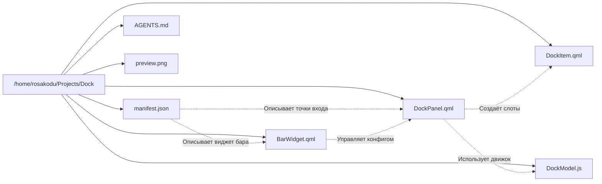

# 01 — Архитектура и Структура файлов

Наверх: [[00 - Omarchy Dock (Главная карта проекта)|Главная карта проекта]]

---

## 🗂️ Обзор структуры репозитория

---

## 📄 Назначение и состав файлов

### 1. `manifest.json`
- **Назначение**: Главный дескриптор плагина для оболочки Omarchy Quattro.
- **Типы плагина (`kinds`)**: `["bar-widget", "panel"]`.
- **Точки входа (`entryPoints`)**:
  - `panel`: `DockPanel.qml` — фоновая панель дока (загружается с флагом `"keepLoaded": true`).
  - `barWidget`: `BarWidget.qml` — виджет для верхней/нижней панели задач Omarchy с кнопкой `···`.

---

### 2. `DockPanel.qml`
- **Назначение**: Ядро визуализации и управления окнами док-бара.
- **Содержит 3 независимых окна Layer-Shell**:
  1. `dockWindow` — основная полоса дока с иконками приложений.
  2. `stackWindow` — окно раскрытой папки (macOS Stacks).
  3. `menuWindow` — контекстное окно выбора иконки папки.
- **Связи**:
  - Подключает [[03 - Модель данных и Персистентность|DockModel.js]] для формирования структуры элементов.
  - Порождает экземпляры [[01 - Архитектура и Структура файлов|DockItem.qml]] внутри `Repeater`.
  - Управляет глобальными состояниями: `isEditMode`, `activeStackItem`, `activeMenuItem`, `dockDragActiveIndex`.

---

### 3. `DockItem.qml`
- **Назначение**: Компонент одного слота приложения на док-баре (размер 42×42 px).
- **Ключевые элементы**:
  - `iconWrapper` — контейнер иконки с анимацией покачивания (Wiggle) и масштабирования.
  - `OpticalGlyph` — компонент для идеального центрирования Nerd Font / Unicode символов.
  - `runningDot` — полоска-индикатор запуска (связана с `dragOffset`).
  - `pinBadge` (`★`) и `dissolveBadge` (`-`) — бейджи управления закреплением/расформированием.
  - `MouseArea` с 1D рельсовым перетаскиванием (`dragOffset.x` или `dragOffset.y`).

---

### 4. `DockModel.js`
- **Назначение**: Чистый движок логики данных и сериализации.
- **Функции**:
  - `parsePinned()` / `serializePinned()` — парсинг и сохранение списка закреплённых элементов.
  - `buildDockItems()` — объединение запущенных окон Hyprland и закреплённых иконок.
  - `mergeIntoStack()` — создание новой папки или добавление приложения в существующую.
  - `dissolveStack()` — расформирование папки.
  - `reorderInStack()` — переупорядочивание иконок внутри 2D-сетки папки.
  - `togglePin()` — закрепление/открепление приложения.

---

### 5. `BarWidget.qml`
- **Назначение**: Виджет на системной панели Omarchy (кнопка `···`).
- **Функционал**:
  - Всплывающая карточка настроек, отцентрированная по экрану.
  - Тумблеры:
    1. `Enable dock` — включение / скрытие дока.
    2. `Autohide dock` — автоматическое скрытие при отведении курсора.
    3. `Folder names` — показ названий папок в карточках каталогов.
  - Сохранение настроек в `~/.config/omarchy/dock-settings.json`.

---

### 6. `AGENTS.md`
- **Назначение**: Архитектурные требования, жесткие правила позиционирования (горизонтальный `runningDot`, `OpticalGlyph`, запрет `git push` без разрешения).

---

## 🔗 Связанные разделы

- [[02 - Окна и Wayland Layer-Shell]]
- [[03 - Модель данных и Персистентность]]
- [[04 - Режим редактирования и Анимации]]
