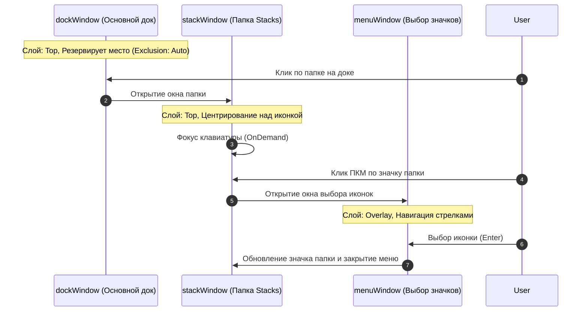

# 02 — Окна и Wayland Layer-Shell (3 Windows)

Наверх: [[00 - Omarchy Dock (Главная карта проекта)|Главная карта проекта]] | Файлы: [[01 - Архитектура и Структура файлов|Архитектура и Файлы]]

---

## 🪟 Архитектура трёх окон PanelWindow

Вся графика и интерактив разделены на **3 изолированных Wayland PanelWindow**, что исключает артефакты отсечения (`clip`), взаимное перекрытие и проблемы с фокусом ввода:

---

## 📐 Спецификация каждого окна

### 1. `dockWindow` (Основной док-бар)
- **Wayland Namespace**: `"omarchy-dock"`
- **Слой (`layer`)**: `WlrLayer.Top`
- **Эксклюзивная зона (`exclusionMode`)**: 
  - `ExclusionMode.Auto` (когда док виден и автоскрытие выключено).
  - `ExclusionMode.Ignore` (в режиме автоскрытия).
- **Двухфазный показ (Tile Lift First)**:
  - При старте `dockWindow` немедленно запрашивает `ExclusionMode.Auto`, заставляя Hyprland поднять тайлинговые окна вверх, пока панель остаётся прозрачной (`opacity: 0.0`).
  - После завершения анимации тайлинга и готовности иконок (`isDockVisualReady = true`) док плавно проявляется на экране в уже освобождённом пространстве.
- **Размеры**:
  - Горизонтальный: `width: itemsCount * 46 + 14`, `height: 54`.
  - Вертикальный: `width: 54`, `height: itemsCount * 46 + 14`.
- **Позиционирование (`anchors`)**:
  - Автоматически ориентируется на противоположную сторону относительно системной панели: если системный бар сверху (`barPosition === "top"`), док снизу (`anchors.bottom: true`), и наоборот.

---

### 2. `stackWindow` (Всплывающая карточка папки Stacks)
- **Wayland Namespace**: `"omarchy-dock-stack"`
- **Слой (`layer`)**: `WlrLayer.Top`
- **Эксклюзивная зона (`exclusionMode`)**: `ExclusionMode.Auto` (поднимает тайлинг окон/плитку Hyprland над доком).
- **Клавиатурный фокус**: `WlrKeyboardFocus.OnDemand` (перехватывает `Escape`, `Enter` и редактирование имени).
- **Позиционирование (`margins`)**: `Style.gapsOut || 5`.

---

### 3. `menuWindow` (Всплывающая плашка окон и палитра значков)
- **Wayland Namespace**: `"omarchy-dock-menu"`
- **Слой (`layer`)**: `WlrLayer.Top`
- **Эксклюзивная зона (`exclusionMode`)**: `ExclusionMode.Auto` (поднимает плитку окон).
- **Клавиатурный фокус**: `WlrKeyboardFocus.OnDemand` (для навигации стрелками `←`, `→`, `↑`, `↓`, `Enter`, `Escape`).
- **Позиционирование**:
  - Располагается строго по центру экрана или над активной папкой/иконкой.

---

## 🔮 Адаптивная прозрачность и Glassmorphism (`isBarTransparent`)

Все поверхности окон дока автоматически синхронизируются с режимом прозрачности системного бара и трея:
- **Отслеживание `bar.transparent`**: В реальном времени считывается флаг прозрачности из `shell.json` (`cfg.bar.transparent`) и параметров `shell.bar`.
- **Режим непрозрачности (`isBarTransparent: false`)**:
  - `dockSurface`: `Color.composed("bar.background", "bar.background-alpha", Color.background, 0.94)`, рамка `Color.accent`.
  - `stackCard`, `menuCard`: `Color.composed("popups.background", "popups.background-alpha", Color.background, 0.96)`, рамка `Color.accent`.
- **Режим прозрачности (`isBarTransparent: true`)**:
  - `dockSurface`: кристальный полупрозрачный фон `Util.alpha(Color.bar.background, 0.25)`, обводка полностью отключена (`border.width: 0`, `border.color: "transparent"`).
  - `stackCard`, `menuCard`: полупрозрачный фон `Util.alpha(Color.popups.background, 0.45)`, обводка полностью отключена (`border.width: 0`, `border.color: "transparent"`).
  - Плавный цветовой и размерный переход `Behavior on color (300ms)`, `Behavior on border.color (300ms)` и `Behavior on border.width (250ms)`.
- **Окно настроек (`settingsCard` в `BarWidget.qml`)**:
  - Всегда остаётся непрозрачным всплывающим окном (`Color.composed("popups.background", ...)`) с чёткой акцентной рамкой `Color.accent` для максимальной читаемости текста и переключателей.

---

## 🔗 Связанные разделы

- [[05 - Папки]]
- [[04 - Режим редактирования и Анимации]]
- [[07 - Автоскрытие и Взаимодействие с Hyprland]]
