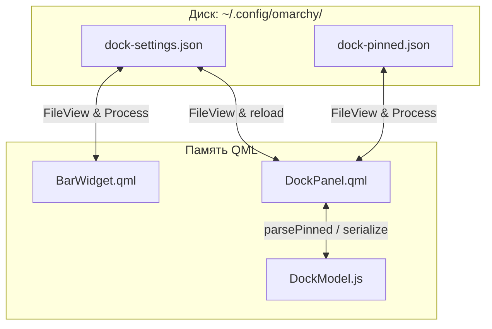

# 03 — Модель данных и Персистентность (Persistence)

Наверх: [[00 - Omarchy Dock (Главная карта проекта)|Главная карта проекта]] | Файлы: [[01 - Архитектура и Структура файлов|Архитектура и Файлы]]

---

## 💾 Конфигурационные файлы

Все пользовательские данные и настройки хранятся в формате JSON в директории `~/.config/omarchy/`:



---

## 1. Файл настроек: `dock-settings.json`

```json
{
  "dockEnabled": true,
  "autohide": false,
  "showFolderTitles": true
}
```

### Реактивное отслеживание и атомарная запись
- `DockPanel.qml` и `BarWidget.qml` используют `FileView` с `watchChanges: true` и `atomicWrites: true`.
- Сохранение настроек выполняется мгновенно и атомарно через `settingsFile.setText()`.
- Свойство `dockWindow.visible` управляется строго реактивно через декларативную привязку (`visible: root.opened && root.pluginEnabled && root.dockEnabled && root.isPinnedLoaded && !remapTimer.running`), исключая поломку биндингов при холодном старте с отключенным доком.

---

## 2. Файл закреплений: `dock-pinned.json`

Файл содержит массив элементов: одиночные `appId` (строки) и структуры папок (объекты).

```json
[
  "firefox",
  "kitty",
  {
    "id": "stack-1723456789",
    "name": "Media",
    "icon": "󰎆",
    "subApps": [
      {
        "appId": "spotify",
        "name": "Spotify",
        "icon": "spotify",
        "exec": "spotify"
      },
      {
        "appId": "vlc",
        "name": "VLC",
        "icon": "vlc",
        "exec": "vlc"
      }
    ]
  },
  "code"
]
```

---

## 3. Запуск и переключение окон (ЛКМ / ПКМ)

- **ЛКМ (Левый клик)**:
  - Если элемент — папка: открывает всплывающую карточку содержимого папки (`stackWindow`).
  - Если элемент — приложение: **всегда создаёт/запускает новый экземпляр (дубликат) приложения** через `launch`/`execDetached`.
- **ПКМ (Правый клик)**:
  - Всегда воспроизводит упругий анимационный тап по иконке (`clickEffectAnim`).
  - Если у приложения **нет запущенных дубликатов** ($0$ или $1$ окно): меню **не открывается** (только анимационный тап).
  - Если у приложения **запущены дубликаты** ($\ge 2$ окон): открывает **статичную всплывающую плашку (`menuCard`)** со списком всех его открытых окон над доком (чистые иконки без статусных точек).
  - **Стабильный хронологический порядок окон (`knownWindows`)**:
    - Окна в меню всегда строго упорядочены по **времени их создания / появления** ($1$-е окно слева, $2$-е окно правее и т.д.).
    - Переключение фокуса, смена рабочих столов или перемещение окон в Hyprland **не перемешивает порядок окон** в меню.
  - Если элемент — папка: открывает статичную палитру выбора значков папки (`menuCard`), где текущий выбранный значок подсвечивается цветом акцента `Color.accent`.

---

## 4. Динамическая инициализация и синхронный показ дока (Zero-Flicker Boot)

- **Монолитное появление дока**: Окно док-бара остаётся скрытым (`dockWindow.visible = false`), пока в фоне выполняется динамическая проверка иконок.
- **Приоритет фоновой проверки**:
  1. В первую очередь проверяется наличие файлов сторонней темы оформления (`shell.appLibrary.iconIndex`). Если сторонние иконки найдены, они подготавливаются для показа.
  2. Если сторонней темы нет (или по истечении таймаута) — подготавливаются стандартные системные иконки.
- **Синхронный вывод на экран (`iconsReady = true`)**: Как только иконки готовы, весь док целиком появляется на экране сразу со всеми готовыми значками без промежуточных пустых плашек, подмен и мельканий.
- **Реактивный счётчик `iconRevision`**: При любых изменениях системных тем или установке новых пакетов `iconRevision++` заставляет все компоненты мгновенно обновлять картинки на лету.
- **Отказ от дискового кэша**: Все иконки разрешаются динамически в рантайме без промежуточных файлов `dock-icon-cache.json`.

---

## 🔗 Связанные разделы

- [[01 - Архитектура и Структура файлов]]
- [[05 - Папки]]
- [[07 - Автоскрытие и Взаимодействие с Hyprland]]

