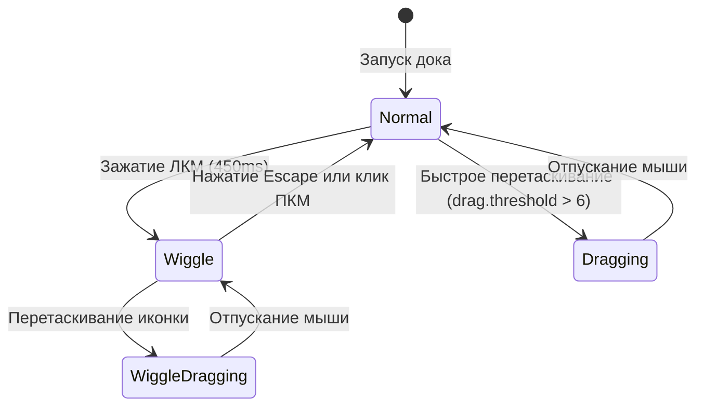

# 04 — Режим редактирования и Анимации (Edit Mode & Wiggle)

Наверх: [[00 - Omarchy Dock (Главная карта проекта)|Главная карта проекта]] | Файлы: [[01 - Архитектура и Структура файлов|Архитектура и Файлы]]

---

## 📳 Поведение режима редактирования (Wiggle Mode)

Режим редактирования переводит док-бар и открытые папки в состояние переупорядочивания и закрепления/открепления элементов, вдохновлённое iOS и macOS.



---

## 📐 Параметры анимации покачивания (Wiggle)

| Параметр | Значение | Описание |
| :--- | :--- | :--- |
| **Угол вращения** | `±3.8°` | Плавное отклонение влево и вправо. |
| **Длительность цикла** | `105 ms` | Время одного полупериода колебания. |
| **Сглаживание** | `Easing.InOutSine` | Органичный и мягкий синусоидальный ход. |
| **Масштаб иконки** | `scale: 0.82` | Уменьшение иконки для освобождения места под бейджи. |
| **Возврат в нейтраль** | `150 ms (OutCubic)` | Плавная остановка вращения в `0.0°` при выходе из режима. |

---

## 🏷️ Бейджи действий (Pin & Dissolve Badges)

В режиме редактирования над уменьшенной иконкой по центру отображаются кнопки быстрых действий:

```
         [ ★ ]  <- pinBadge (для одиночных приложений)
         [ - ]  <- dissolveBadge (для папок)
        +-----+
        |     | <- iconWrapper (scale: 0.82, rotation: ±3.8°)
        +-----+
```

- **Звёздочка закрепления (`pinBadge`)**:
  - Всегда залитая звезда `★`.
  - Если приложение **закреплено** (`isPinned: true`) — цвет `Color.accent`.
  - Если **не закреплено** — полупрозрачный приглушённый цвет текста.
  - Клик по звёздочке переключает статус закрепления и сохраняет в `dock-pinned.json`.
- **Минус расформирования папки (`dissolveBadge`)**:
  - Отображается над папками.
  - Клик по `-` расформировывает папку, возвращая все её приложения на док-бар отдельными иконками.

---

## 🚫 Скрытие элементов и курсора при Drag & Drop

- **Скрытие бейджей**: При начале перетаскивания (`isAnyDragging === true` или `root.folderDragActiveIndex >= 0`) звёздочки `★` и минусы `-` мгновенно скрываются, чтобы не мешать визуальному совмещению иконок.
- **Скрытие курсора**: Во время перетаскивания иконки как по док-бару (`root.dockDragActiveIndex >= 0`), так и внутри открытой папки (`root.folderDragActiveIndex >= 0`), все интерактивные области и фон переключаются в **`Qt.BlankCursor` (курсор мыши полностью скрывается)**, обеспечивая ощущение прямого тактильного манипулирования объектом без наложения системного указателя.
- **Защита от ложного клика (`didLongPress`)**: Зажатие мыши для входа в режим редактирования выставляет флаг `didLongPress = true`, исключая случайный запуск приложения или открытие папки при отпускании кнопки.

---

## 🔗 Связанные разделы

- [[01 - Архитектура и Структура файлов]]
- [[05 - Папки]]
- [[06 - Индикаторы запуска и Оптическое центрирование]]
