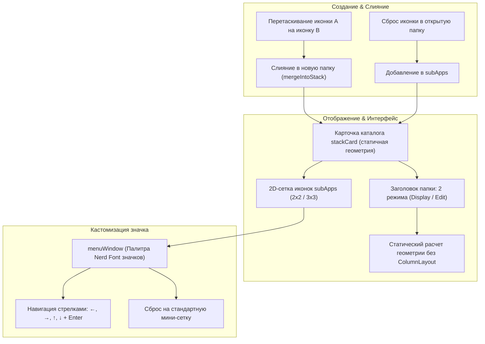

# 05 — Папки (Stacks & SubApps)

Наверх: [[00 - Omarchy Dock (Главная карта проекта)|Главная карта проекта]] | Окна: [[02 - Окна и Wayland Layer-Shell|Окна Layer-Shell]]

---

## 📁 Архитектура группировки приложений (macOS Stacks)

Папки позволяют объединять любое количество приложений в компактные стеки с возможностью быстрого запуска, перемещения и кастомизации значков.



---

## 📝 Заголовок папки: Двухрежимная система (Display Marquee / Edit)

Чтобы исключить переносы слов на две строки и некрасивые точки `...`, заголовок папки работает в двух специализированных состояниях:

```
[Режим отображения]: "Очень длинное название папки..." -> плавная бегущая строка (Marquee Ticker)
[Режим ввода]:       "Очень длинное название папки|" -> TextInput с горизонтальным автоскроллом
```

1. **Режим отображения (Display Marquee Mode)**:
   - Если название папки помещается в карточку — оно отображается статично по центру.
   - Если название длиннее ширины карточки — запускается плавная **бегущая строка (Marquee Ticker)** (`marqueeAnim`).
   - **Покачивание при наведении (Hover Wiggle)**: При наведении курсора мыши на заголовок активируется анимация покачивания (`titleJiggleAnim`: $\pm 3.8^\circ$, `105ms`), а курсор мыши **полностью скрывается (`Qt.BlankCursor`)**.
   - В общем режиме редактирования (`isEditMode`) заголовок покачивается синхронно со всеми иконками.
2. **Режим редактирования (Edit Mode)**:
   - Активируется по клику на заголовок. Покачивание останавливается (`resetTitleRotation`).
   - Компонент `TextInput` с `clip: true`. При вводе длинного текста текст плавно скроллится вслед за курсором каретки.
   - Выделение всего текста при получении фокуса (`selectAll()`).
   - Завершение ввода по `Enter` или клику вне поля ввода с мгновенным сохранением в `dock-pinned.json`.

---

## 📐 Динамическая мини-сетка значка папки (`stackGrid`)

Если у папки не выбран специальный кастомный символ, её значок отображает адаптивную миниатюру входящих приложений:
- **До 4 приложений**: компактная сетка 2×2 (`cellWidth: 10 px`), отображающая до 4 иконок.
- **Более 4 приложений**: адаптивная сетка 3×3 (`cellWidth: 6.5 px`), отображающая до 9 иконок (все добавленные приложения, включая 5-е, 6-е и т.д., видны в миниатюре).

---

## 📐 Динамическое растяжение карточки (`TextMetrics`)

Ширина карточки папки рассчитывается динамически:
- **Базовая ширина сетки**: `118 px` (для 2 колонок приложений).
- **Расчёт ширины**: `Math.max(baseGridWidth, Math.min(maxCardWidth, desiredTitleWidth))`
- **Максимальная ширина**: `260 px`.
- **Мгновенное открытие без дрожания**: Анимация ширины (`Behavior on width`) активна **только во время ввода текста** (`enabled: titleInput.activeFocus`), благодаря чему папка открывается сразу с готовым размером без задержек.

---

## 🎨 Выбор значка папки (`menuCard`)

- **Вызов меню**: Клик ПКМ по значку папки в карточке каталога.
- **Управление и навигация**:
  - **Колёсико мыши**: прокрутка колесиком мыши над панелью плавно перебирает все доступные значки палитры.
  - `←`, `→` — перемещение по строке иконок.
  - `↑`, `↓` — перемещение между строками палитры.
  - `Enter` / `Space` или клик ЛКМ — выбор значка и сохранение.
  - `Escape` — закрытие палитры.
- **Сброс значка**: Повторный клик по выбранной иконке сбрасывает её на стандартную мини-сетку из четырёх иконок приложений.

---

## 🚪 Открытие и закрытие папки (Toggle & Dismissal)

- **Клик ЛКМ по папке**: Если папка закрыта — открывает карточку папки; если папка уже открыта — повторный клик ЛКМ по значку папки на доке мгновенно закрывает её (даже если курсор не сдвигался с места).
- **Зажатие ЛКМ (450 мс)**: Активирует режим редактирования (покачивание иконок) на доке без открытия папки.
- **Клик ЛКМ в режиме редактирования**: Открывает карточку папки сразу в режиме редактирования (со значками извлечения и покачиванием внутри).
- **Клик за пределами карточки папки**: При клике в любую область экрана вне карточки папки (`stackCard`), включая прозрачные поля оверлея `stackWindow`, подложку док-бара `dockSurface` или рабочий стол/другие окна, папка плавно закрывается (`root.activeStackItem = null`).
- **Клавиша Escape**: Нажатие `Escape` синхронно закрывает открытую папку и сбрасывает режим редактирования.
- **Клик по другой папке**: Клик по другой папке на док-баре закрывает текущую и сразу открывает выбранную.

---

## 🔗 Связанные разделы

- [[02 - Окна и Wayland Layer-Shell]]
- [[03 - Модель данных и Персистентность]]
- [[04 - Режим редактирования и Анимации]]
- [[06 - Индикаторы запуска и Оптическое центрирование]]
