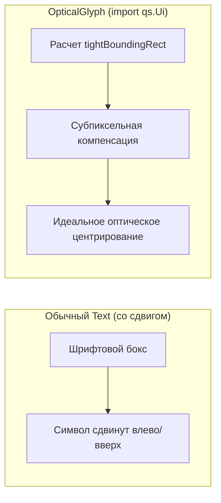

# 06 — Индикаторы запуска и Оптическое центрирование

Наверх: [[00 - Omarchy Dock (Главная карта проекта)|Главная карта проекта]] | Файлы: [[01 - Архитектура и Структура файлов|Архитектура и Файлы]]

---

## 🎯 Индикаторы запуска (`runningDot`)

Индикатор активности приложения показывает запущенные и активные приложения на док-баре в виде аккуратной горизонтальной капсулы:

```
       +--------------+
       |     [Icon]   |
       +--------------+
            ======        <- активно (Color.accent, 12px) / в фоне (5px)
```

### Архитектурные правила:
1. **Позиция**: Всегда строго горизонтальная капсула, расположенная **снизу под иконкой по центру** (`x: Math.round((parent.width - width)/2 + dragOffset.x)`, `y: parent.height - height - 2 + dragOffset.y`).
2. **Ориентация дока**: И при горизонтальном, и при вертикальном расположении дока индикатор остаётся горизонтальным снизу под иконкой.
3. **Размеры**:
   - **Неактивно** (в фоне): ширина `5 px`, цвет `Color.composed("bar.text", "bar.text-alpha", Color.text, 0.75)`.
   - **Активно** (в фокусе): ширина `12 px`, цвет `Color.accent`.
   - Высота: `2.5 px`, скругление: `1.25 px`.
4. **Синхронизация с Drag & Drop**:
   - Координаты привязаны к `dragOffset`. При перетаскивании приложения индикатор плавно следует за иконкой.
5. **Исключение ложных срабатываний (`matchToplevel`)**:
   - Сопоставление открытых окон ведётся строго по `appClass` (Wayland App ID), файлу `.desktop` и имени исполняемого бинарного файла (`exec`).
   - Поиск по случайным подстрокам заголовков окон (`title.indexOf`) полностью отключен, что исключает ошибочную подсветку индикатора Steam (или других приложений), если их название случайно встречается в заголовке вкладки браузера или редактора кода.

---

## 👁️ Оптическое центрирование символов (`OpticalGlyph`)

### Проблема типографики:
Unicode-глифы и Nerd Font иконки (например: `󰖩`, `♥`, `★`, `-`, `󰉋` и др.) имеют несимметричные боковые полуапроши и внутренние отступы в моноширинных таблицах шрифтов. Обычное размещение `anchors.centerIn: parent` сдвигает символ на 1.5–3 пикселя в сторону.



### Решение в Omarchy Dock:
Все символы, бейджи и иконки выбора отрисовываются через собственный локальный компонент `OpticalGlyph.qml`:
- `stackSymbolText` — значок папки на док-баре.
- `pinBadge` — звёздочка закрепления `★`.
- `dissolveBadge` — знак расформирования `-`.
- Иконки выбора значка папки в меню (`availableFolderIcons`).
- Кнопка удаления `-` в меню папок.

Компонент автоматически считывает `tightBoundingRect` векторного глифа и рассчитывает субпиксельное смещение `horizontalCorrection`, центрируя визуальную массу значка точно по пиксельной сетке.

- **Сглаженный рендеринг (`Text.QtRendering`)**: В отличие от системного `Text.NativeRendering`, который при покачивании (`rotation`) привязывается к целочисленным пикселям экрана и вызывает дребезжание, локальный `OpticalGlyph` использует `Text.QtRendering` со сглаживанием (`antialiasing: true`, `smooth: true`), гарантируя плавную GPU-анимацию покачивания и идеальную субпиксельную оптику.

---

## 🔗 Связанные разделы

- [[01 - Архитектура и Структура файлов]]
- [[04 - Режим редактирования и Анимации]]
- [[05 - Папки]]
