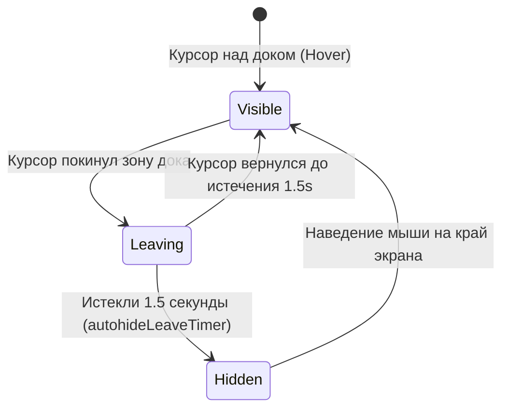
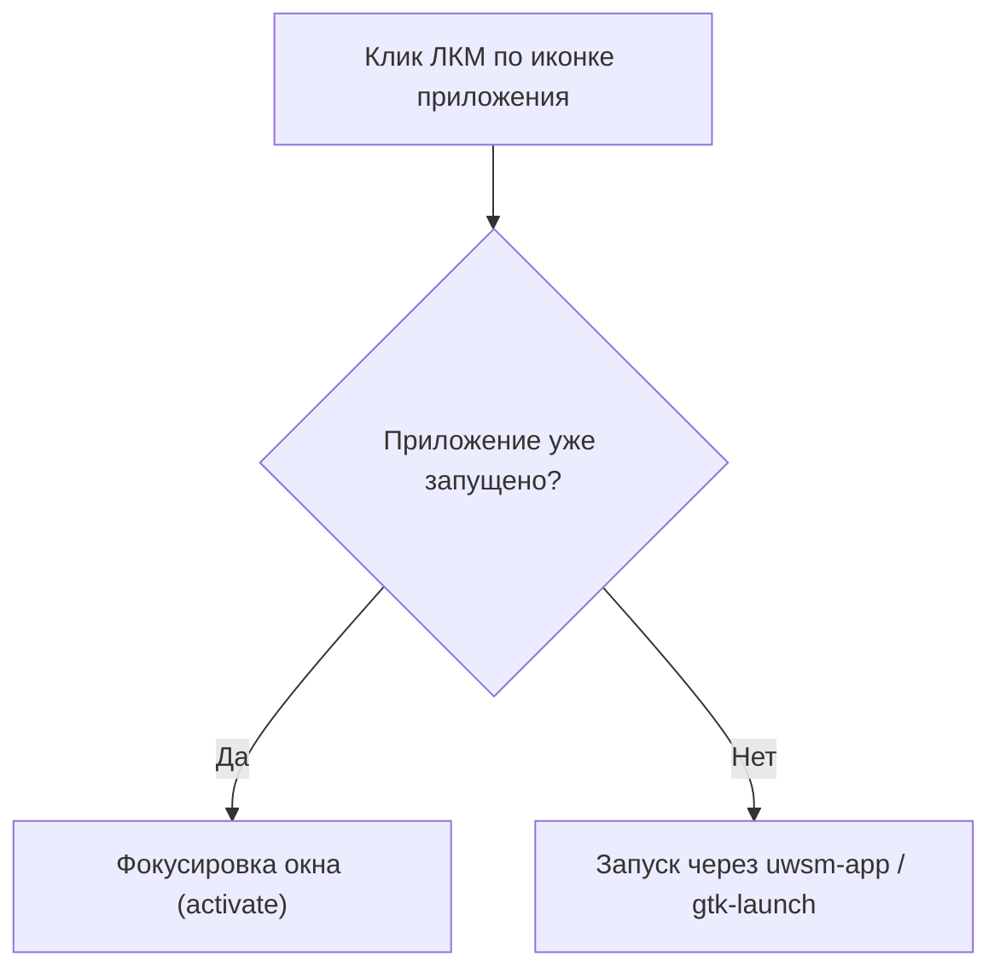

# 07 — Автоскрытие и Взаимодействие с Hyprland (Autohide & Toplevels)

Наверх: [[00 - Omarchy Dock (Главная карта проекта)|Главная карта проекта]] | Модель данных: [[03 - Модель данных и Персистентность|Модель данных]]

---

## ⚡ Автоматическое скрытие дока (Autohide)

Режим автоскрытия позволяет освободить всё полезное экранное пространство для приложений, выдвигая док только при наведении мыши на край экрана.

### Логика удержания дока в открытом состоянии (`isDockActive`):
Док **не скрывается**, если выполняется хотя бы одно из условий:
1. `isDockHovered === true` (курсор находится над панелью).
2. `isStackOpen === true` (открыта карточка папки).
3. `isMenuOpen === true` (открыто контекстное меню выбора значков).
4. `dockDragActiveIndex >= 0` (идёт процесс перетаскивания иконки).

### Таймер ухода (`autohideLeaveTimer`):
- Задержка перед скрытием составляет **1.5 секунды** (`interval: 1500`).
- Защищает от случайных рывков интерфейса при быстром перемещении курсора через док.

---

## 🪟 Интеграция с окнами Hyprland (`Quickshell.Hyprland`)

1. **Активация запущенных приложений**:
   - При клике ЛКМ по запущенному приложению вызывается нативный `activate()` для фокусировки окна.
   - Если окно уже в фокусе и открыто несколько окон, клик переключает на следующее окно.

2. **Безопасный запуск новых приложений**:
   - Используется `uwsm-app -- gtk-launch <appId>.desktop` с fallback на прямой бинарник.

---

## 🔗 Связанные разделы

- [[02 - Окна и Wayland Layer-Shell]]
- [[03 - Модель данных и Персистентность]]
- [[06 - Индикаторы запуска и Оптическое центрирование]]

